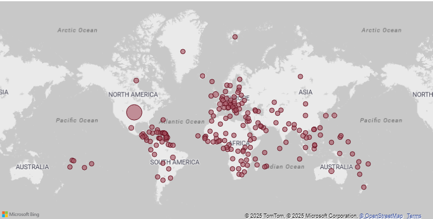
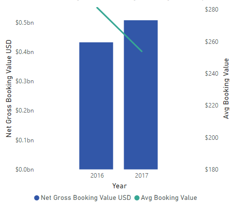
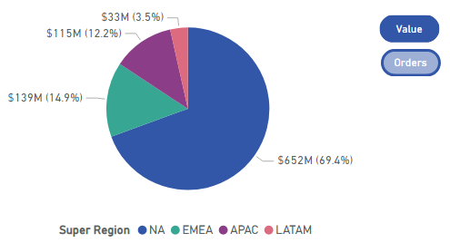
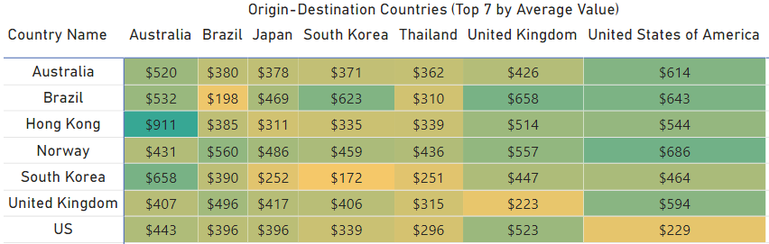

# Travel Booking Analytics Dashboard

## Overview
This Power BI dashboard visualizes comprehensive booking data across global travel markets. The dashboard provides actionable insights into booking patterns, regional performance, and market trends through three main analytical views:

1. **Data Overview** - High-level metrics and key performance indicators
2. **Granular Analysis** - Weekly and yearly growth trends with detailed breakdowns
3. **Market Analysis** - Country-specific performance and origin-destination patterns

## Key Metrics Tracked

- Total Orders: 3.5M
- Total Booking Value: $939.1M
- Average Booking Value: $265.7
- YoY Order Growth: 30%
- YoY Value Growth: 17%

## Dashboard Components

### Data Overview
The first view presents a high-level summary of performance metrics:

- **Platform Distribution**: Desktop is the dominant platform (64.45%), followed by Mobile Web (20.93%) and Mobile App (14.62%)
- **Regional Performance**: North America leads with 75.2% of orders, followed by EMEA (12.7%), APAC (9.5%), and LATAM (2.6%)
- **Booking Window Analysis**: 
  - 0-1 days window accounts for ~35% of net orders
  - 90+ days advance bookings have the highest average value ($582), approximately 3.6x higher than last-minute bookings
- **Country Performance**: Top performers by booking value include US ($0.65bn), UK ($0.11bn), and others

### Granular Analysis
The second view breaks down performance metrics over time:

- Weekly order and value growth trends across 2016-2017
- Year-over-year growth metrics showing 30% order growth and 17% value growth
- Weekly performance data showing significant growth in 2017-W45 to 2017-W47
- Notable insight: Average booking value decreased by ~10% YoY, suggesting a shift toward more budget-conscious travelers

### Market Analysis
The third view provides geographical insights and country-specific performance:

- Coverage across 206 unique property countries
- Top 5 countries represent 76% of total booking value
- Origin-destination analysis showing highest value routes
- US generates 69% of booking value and is also the top destination (62% of value)
- International travel to the US averages ~$600 per booking
- Detailed weekly breakdown of orders across top 5 property countries

## Platform Analysis
The dashboard shows booking distribution across devices:

- Desktop: 2M orders (64.45%)
- Mobile Web: 1M orders (20.93%)
- Mobile App: 1M orders (14.62%)

## Visualization Examples

Example 1: Geographical Distribution

Example 2: YoY Growth Chart

Example 3: Interactive view using buttons

Example 4: Heatmap

## Technical Information

### Data Sources
This dashboard is powered by comprehensive booking data containing:
- Order information (counts and values)
- Platform usage metrics
- Geographic data
- Temporal data (weekly and yearly trends)
- Origin-destination pairing information

### Dashboard Usage
The dashboard includes interactive filters and drill-down capabilities:
- Country selectors
- Year filters
- Value vs. Orders buttons

## Insights & Business Implications

1. **Platform Strategy**: Heavy desktop usage suggests opportunity for mobile experience optimization
2. **Regional Focus**: North America dominates performance, indicating potential for targeted growth in other regions
3. **Advance Booking Value**: Significant value differential for advance bookings suggests promotion opportunities
4. **Budget Trend**: 10% YoY decrease in average booking value highlights market shift toward budget-conscious offerings
5. **US Market Dominance**: Circular domestic travel pattern within US presents opportunities for package deals

---

*Dashboard created using Microsoft Power BI with data visualization best practices*

**Download the pbix file to view the dashboard in PowerBI Desktop*

